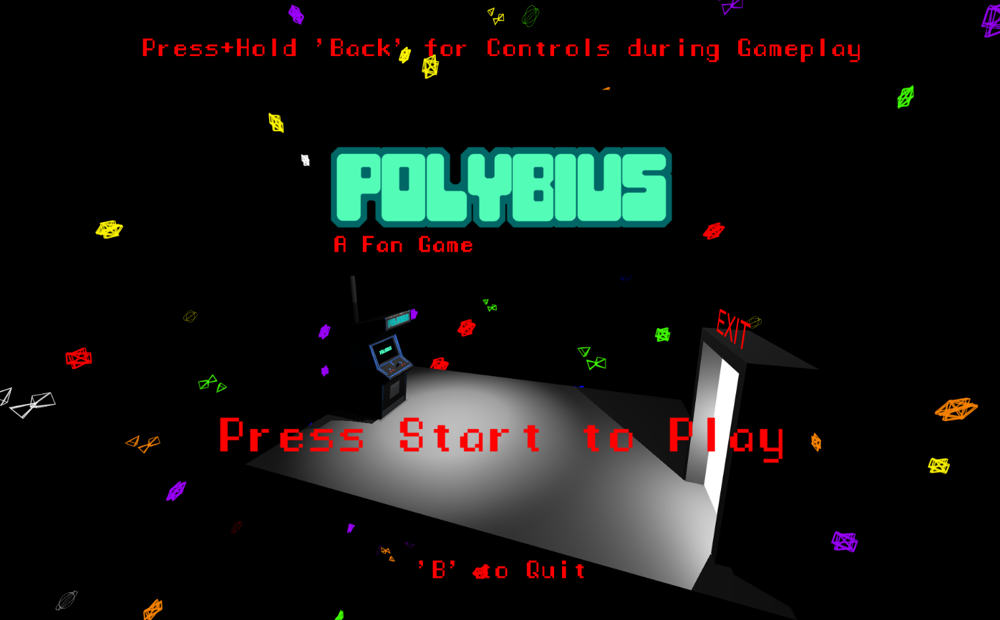
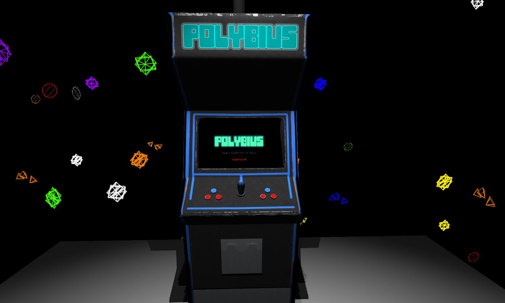
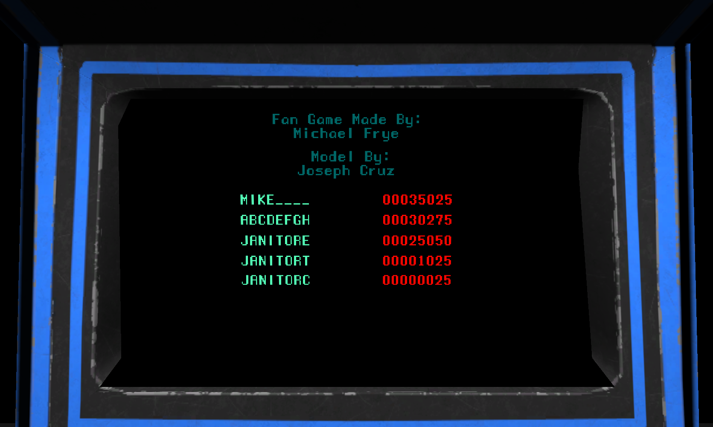
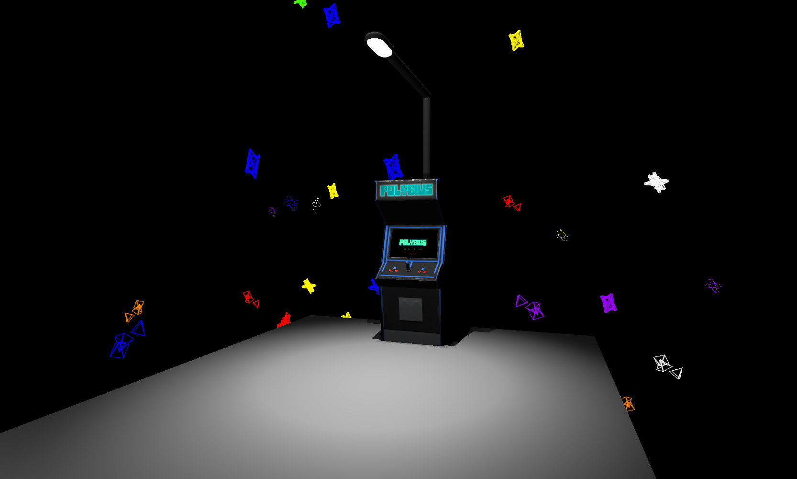
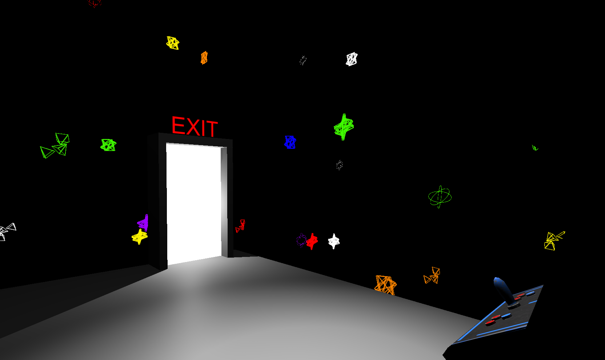
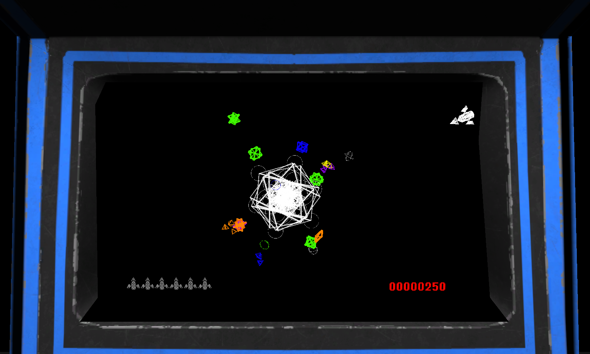
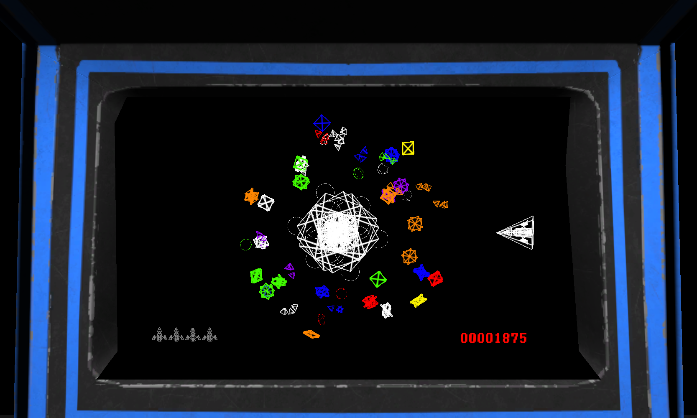
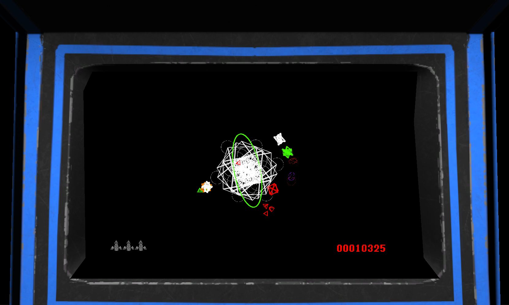
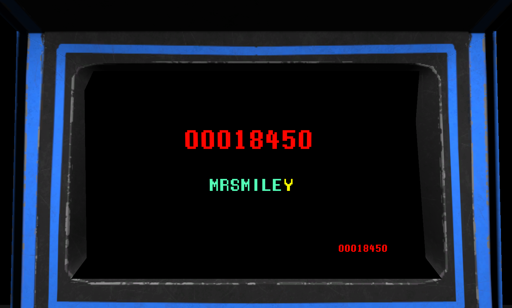

# Polybius Arcade Fan Game

## Description:
  A working Polybius Arcade Cabinet you can virutally walk up to and play. (Works with Unity 2018.2.0f2)

## Implementation Directions:
  You should be able to launch the project, go into 'SampleScene' and have it all work.
I made the thing modular enough where you can effectively export it as a Unity package and use it in your own project if you wish. The only thing you need to be concerned about is linking your FPS controller to the arcade machine so it can interact with the arcade machine.
The FPS controller it comes with is basic enough to get the job done for a stand alone project.

## Controls (Keyboard+Mouse):
  * WASD to move around. (Both FPS Mode and Arcade Mode)
  * Mouse to look around. (FPS Mode)
  * E to interact with the machine. (FPS Mode)
  * SPACE to shoot. (Arcade Mode)
  * ENTER to input a coin into the machine. (Arcade Mode)
  * ESCAPE to Quit. (When in Main Menu)

## Controls (Xbox Controller):
  * Move Left Joystick to move around. (Both FPS Mode and Arcade Mode)
  * Move Right Joystick to look around. (FPS Mode)
  * 'X' to interact with the machine. (FPS Mode)
  * 'A' to shoot. (Arcade Mode)
  * 'Start' to input a coin into the machine. (Arcade Mode)
  * 'B' to Quit. (When in Main Menu)

# Note:
  The arcade should be limited to two specific rotations on the y-axis (0 and 180), otherwise the arcade machine won't display anything. This is because the game uses Vector2D.

# Screenshots:

